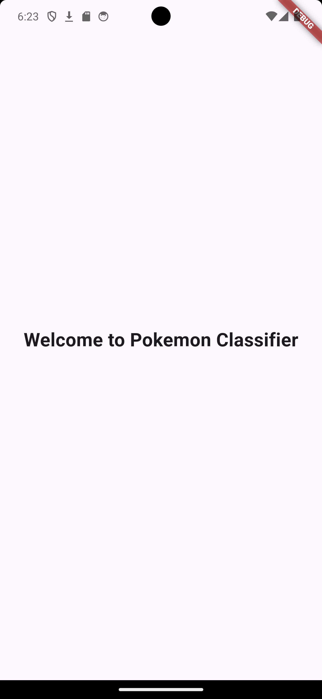
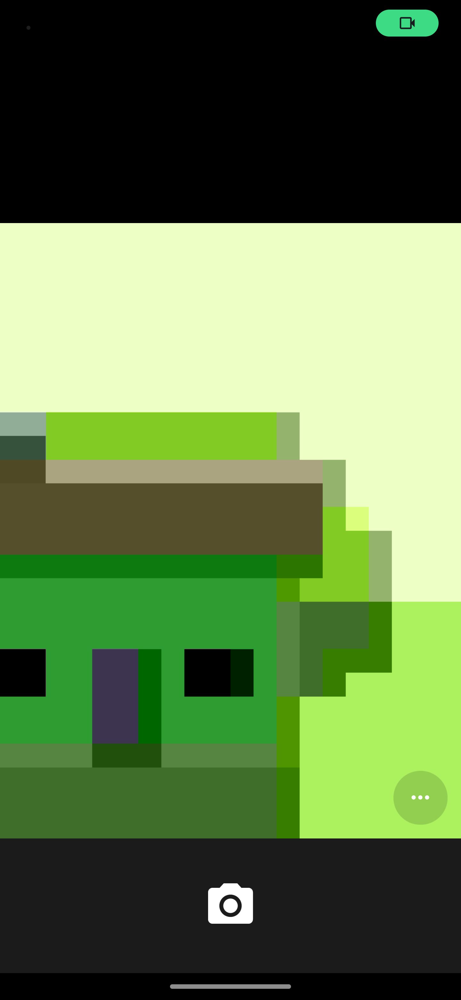
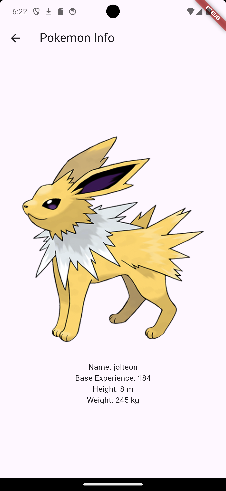
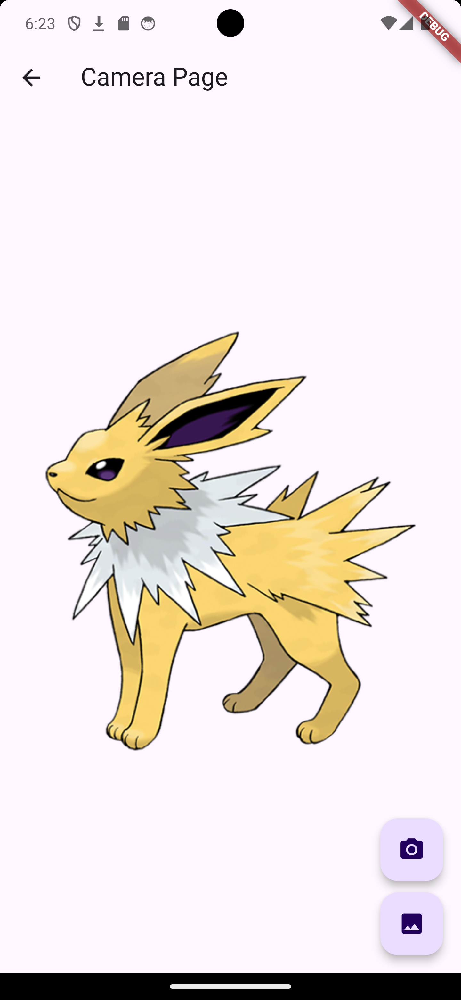

# Pokedex Image Classifier

This project aims to create a Pokedex Image Classifier using TensorFlow Lite and Flutter. The app classifies images of Pokemon and displays the results in a user-friendly interface.

## Project Status

**Ongoing**

### TODO:
- Quantize the model due to insufficient memory in the byte buffer.
- Remodel the UI for a better user experience.
- Add a Pokedex-style output page.

## Features

- **Image Classification:** Classifies Pokemon images using a TensorFlow Lite model.
- **User-Friendly Interface:** Simple and intuitive UI for image selection and result display.
- **Pokedex-Style Output:** Planned feature to display results in a Pokedex-style interface.

## Screenshots

| Current UI | Inference Result | Planned UI Remodel | Pokedex-Style Output |
|------------|------------------|---------------------|----------------------|
|  |  |  |  |

## Getting Started

### Prerequisites

- [Flutter](https://flutter.dev/docs/get-started/install)
- [TensorFlow Lite](https://www.tensorflow.org/lite/guide)

### Installation

1. **Clone the repository:**
   ```sh
   git clone https://github.com/GeryJonathan/Pokedex.git
   cd Pokedex
   ```

2. **Install dependencies:**
   ```sh
   flutter pub get
   ```

3. **Add the TensorFlow Lite model and labels:**
   - Place your `model_quant.tflite` in the `assets` folder.
   - Place your `labels.txt` in the `assets` folder.

4. **Update `pubspec.yaml`:**
   Ensure your `pubspec.yaml` includes:
   ```yaml
   flutter:
     assets:
       - assets/model_quant.tflite
       - assets/labels.txt
   ```

### Running the App

1. **Connect a device or start an emulator.**
2. **Run the app:**
   ```sh
   flutter run
   ```

## Quantizing the Model

To reduce the model size and handle memory constraints, quantize your TensorFlow model as follows:

1. **Convert and Quantize:**
   ```python
   import tensorflow as tf

   # Load the SavedModel
   saved_model_dir = 'path_to_saved_model_directory'
   converter = tf.lite.TFLiteConverter.from_saved_model(saved_model_dir)

   # Enable dynamic range quantization
   converter.optimizations = [tf.lite.Optimize.DEFAULT]

   # Convert the model
   tflite_quant_model = converter.convert()

   # Save the quantized model to a file
   with open('model_quant.tflite', 'wb') as f:
       f.write(tflite_quant_model)
   ```

2. **Use the quantized model in your Flutter app:**
   - Replace the existing model with `model_quant.tflite`.


