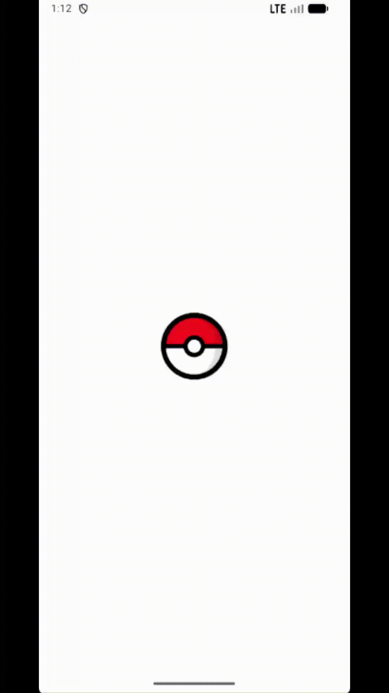
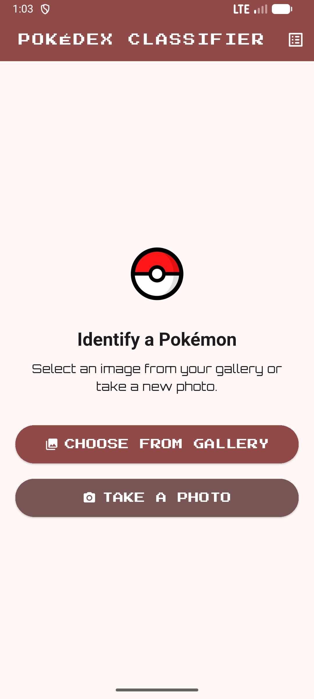
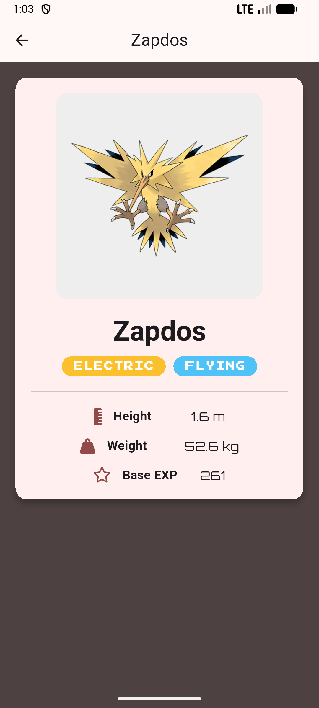
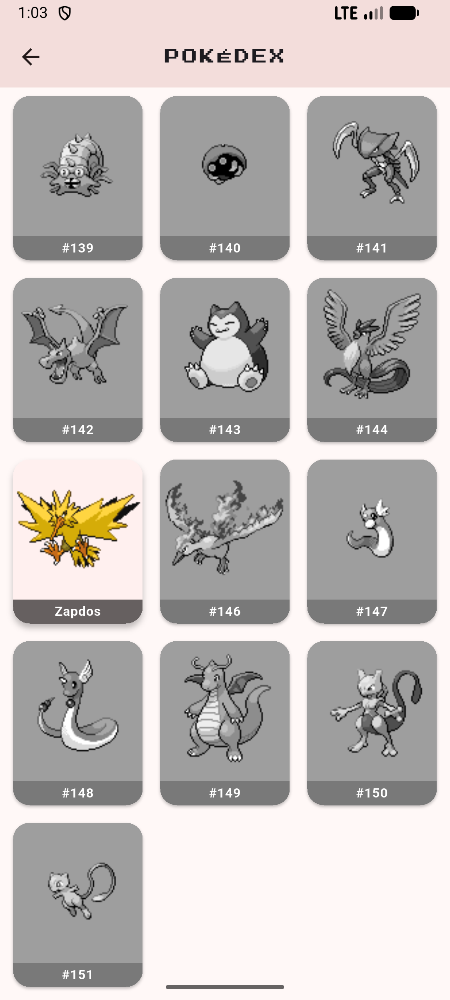
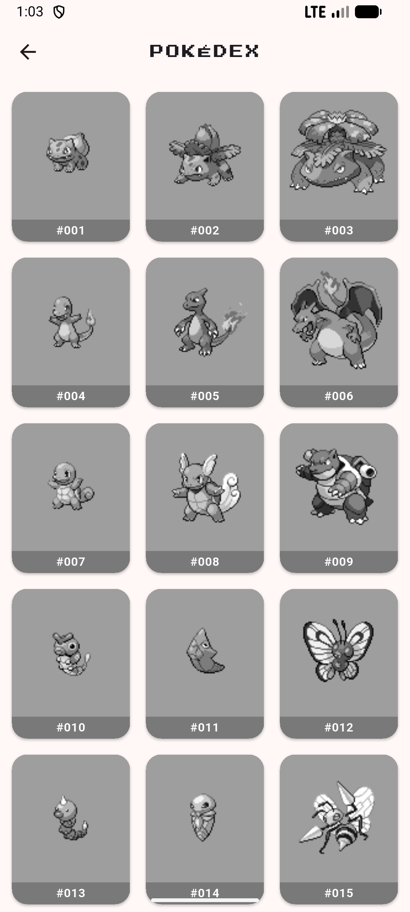

# Pokédex Classifier 📸

A mobile application built with **Flutter** that uses a custom-trained **TensorFlow Lite** model to identify Pokémon from a phone's camera or gallery. Once identified with high confidence, the Pokémon is added to a persistent, personal Pokédex catalog.

---

## 📱 Screenshots & Demo


| Splash Screen | Home Screen | Capture Animation |
|---------------|-------------|-------------------|
|  |  |  |

| Result Page | Pokédex (Captured) | Pokédex (Hidden) |
|-------------|--------------------|------------------|
|  |  |  |


---

## 📋 About The Project

This project leverages **deep learning** to create a real-world Pokédex experience.  
The app uses a custom **image classification model**, trained with **TensorFlow + Keras**, to identify the original **151 Pokémon** from user-provided images.

### Highlights
- Initial proof-of-concept proved feasibility but faced performance challenges due to model size.  
- The model was optimized via **quantization**, reducing memory and improving inference speed.  
- Uses **MobileNetV2** as the backbone, fine-tuned on a specialized Pokémon dataset.  
- Runs fully offline thanks to **TensorFlow Lite** deployment.

---

## ✨ Features

- ⚡ **Optimized On-Device AI**: Quantized MobileNetV2 model for fast, efficient offline classification.  
- 🎯 **High-Confidence Predictions**: Identifies only when ≥80% confident for higher accuracy.  
- 📷 **Camera & Gallery Support**: Capture via camera or choose from gallery.  
- 🎬 **Engaging Capture Animation**: Mimics the classic Pokéball capture sequence.  
- 📖 **Persistent Pokédex Catalog**: Tracks all 151 Pokémon locally, works offline.  
- 📝 **Detailed Pokémon Info**: Stats, types, and artwork fetched via **PokéAPI**.  

---

## 📂 Project Structure

├── Pokedex (Flutter)/ # Flutter Application \
│ ├── assets/ \
│ │ ├── images/ # Local Pokémon sprites (1.png, 2.png, ...) \
│ │ ├── pokemon-classifier.tflite # Trained & quantized TFLite model \
│ │ ├── labels.txt # Model labels \
│ │ └── pokemon_list.json # Static list of Gen 1 Pokémon \
│ ├── lib/ # Flutter source code \
│ └── pubspec.yaml \
│ \
├── Pokemon Model (modeling)/ # ML Model Development \
│ ├── Pokemon_Classifier.ipynb # Training & conversion notebook \
│ ├── Testing.ipynb # Testing notebook \
│ └── quantization.py # Quantization script \
│ \
└── screenshots/ # Screenshots & GIFs for README \


---

## 🧠 Model Training & Optimization

- **Base Model:** MobileNetV2 (lightweight, mobile-friendly).  
- **Dataset:** Curated images of the original 151 Pokémon.  
- **Data Augmentation:** Rotation, flips, shifts, shear, and zoom for robustness.  

### Training Process
1. Freeze base MobileNetV2 layers, train new classifier head.  
2. Fine-tune full model with low learning rate.  
3. Achieved **~93% validation accuracy**.  

### Optimization
- Applied **Dynamic Range Quantization** (32-bit → 8-bit weights).  
- Reduced file size & latency, improved inference speed.  
- Exported to **TensorFlow Lite** format for Flutter integration.  

---

## 🛠️ Built With

- [Flutter](https://flutter.dev/) – Cross-platform mobile framework  
- [TensorFlow Lite](https://www.tensorflow.org/lite) – On-device inference  
- [Provider](https://pub.dev/packages/provider) – State management  
- [PokéAPI](https://pokeapi.co/) – Pokémon data API  
- [Shared Preferences](https://pub.dev/packages/shared_preferences) – Local persistence  
- [Google Colab / Jupyter](https://colab.research.google.com/) – Model training  

---

## 🚀 Getting Started

Follow these steps to run the project locally:

### Prerequisites
- Install [Flutter SDK](https://docs.flutter.dev/get-started/install).

### Installation
```bash
# Clone repository
git clone https://github.com/GeryJonathan/Pokedex.git
cd "Pokedex/Pokedex"

# Install dependencies
flutter pub get

# Run on emulator or connected device
flutter run
